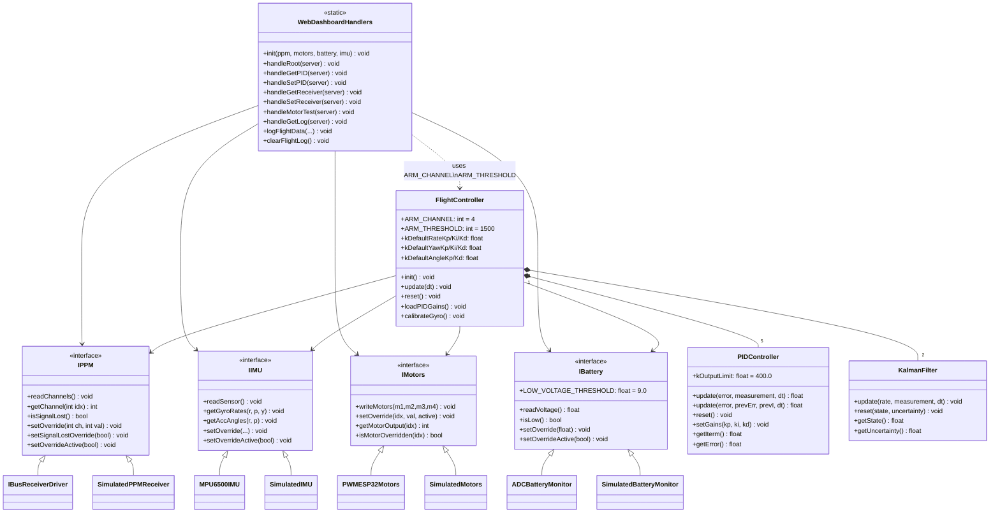

# System Architecture & Folder Structure

---

## Directory Layout

```text
esp32_drone/
├── include/
│   ├── interfaces/               # Abstract hardware interfaces (HAL)
│   │   ├── IIMU.h
│   │   ├── IPPM.h
│   │   ├── IMotors.h
│   │   └── IBattery.h
│   ├── core/                     # Platform-independent algorithms
│   │   ├── FlightController.h
│   │   ├── PIDController.h
│   │   └── KalmanFilter.h
│   ├── hardware/                 # ESP32 driver headers
│   │   ├── MPU6500IMU.h          # SPI IMU (MPU6500)
│   │   ├── IBusReceiverDriver.h  # i-BUS serial RC receiver
│   │   ├── PWMESP32Motors.h      # LEDC PWM ESC driver
│   │   ├── ADCBatteryMonitor.h   # ADC voltage divider
│   │   └── QMC5883LCompass.h     # I2C compass (aux, unused in flight loop)
│   ├── network/
│   │   ├── WebDashboardHandlers.h
│   │   ├── WebDashboardPage.h    # Embedded HTML (generated string)
│   │   └── WebDashboardServer.h
│   └── simulation/
│       └── SimulatedHardware.h   # Mock implementations for native tests
├── src/
│   ├── core/
│   │   ├── FlightController.cpp  # update() loop, arm/disarm, motor mixing
│   │   ├── FlightControllerPID.cpp # loadPIDGains() — split to stay under 100 lines
│   │   ├── PIDController.cpp
│   │   └── KalmanFilter.cpp
│   ├── hardware/
│   │   ├── MPU6500IMU.cpp
│   │   ├── IBusReceiverDriver.cpp
│   │   ├── PWMESP32Motors.cpp
│   │   ├── ADCBatteryMonitor.cpp
│   │   └── QMC5883LCompass.cpp
│   ├── network/
│   │   ├── WebDashboardHandlers.cpp
│   │   ├── WebDashboardHandlersLog.cpp  # logFlightData / handleGetLog
│   │   └── WebDashboardServer.cpp
│   └── main.cpp                  # FreeRTOS task setup, hardware instantiation
├── tests/
│   ├── test_main.cpp             # doctest entry point
│   └── test_tdd/
│       ├── test_pid.cpp
│       ├── test_kalman.cpp
│       ├── test_flight_controller.cpp
│       └── test_simulation.cpp
├── platformio.ini
├── CLAUDE.md
├── architecture.md
└── handoff.md
```

---

## Class Diagram



---

## FreeRTOS Task Layout

```text
Core 0
├── Battery Task (priority 1)
│     ADCBatteryMonitor::update() every ~1s
│     Blinks GPIO 2 LED when voltage < 9.0V
└── Web Task (priority 1)
      Active only when DISARMED (ch4 ≤ 1500)
      WebDashboardServer::handleClient() with 5ms delay
      Wi-Fi SoftAP: ESP32_Drone_Config / 12345678 → http://192.168.4.1/

Core 1
└── Flight Task (priority 2)
      FlightController::update(0.004f) at 250Hz (4ms)
      Fixed-interval timer: loopTimer += 4000µs
```

---

## Flight Control Loop (FlightController::update)

```text
readSensor() + readChannels()
       │
       ▼
Signal lost? ──yes──► reset() motors to 1000 + return
       │
       ▼
AUX1 (ch4) > 1500? ──no──► reset if was armed, return
       │
       ▼ first arm only:
Throttle < 1050? ──no──► refuse arm, return
       │
       ▼
loadPIDGains() from NVS
       │
       ▼
Get gyro rates + accel angles
Kalman filter → fused roll/pitch angle
       │
       ▼
Outer angle PID:  desired_angle → desired_rate  (roll + pitch)
Inner rate  PID:  desired_rate  → correction    (roll + pitch + yaw)
       │
       ▼
Motor mixing (MIXING_SCALE = 1.024):
  M1 = throttle − roll − pitch − yaw
  M2 = throttle − roll + pitch + yaw
  M3 = throttle + roll + pitch − yaw
  M4 = throttle + roll − pitch + yaw
       │
       ▼
Saturation: shift-clamp all motors together
  hi > 2000  → shift all down
  lo < 1180  → shift all up
  then hard-clamp each to [1180, 2000]
       │
       ▼
Throttle < 1050? → reset to 1000 (idle cutoff)
       │
       ▼
writeMotors()
```

---

## Hardware Connection Diagram

```text
                  +-----------------------------------+
                  |        ESP32 DEV MODULE           |
                  |                                   |
                  | [3V3] [GND] [RX2] [I2C] [SPI]    |
                  +---+-----+-----+----+----+---------+
                      |     |     |    |    |
   +------------------+     |     |    |    |
   | (3.3V Power)           |     |    |    |
   |                        |     |    |    |
   v                        v     |    |    v
+--+-------------+       +--+--+  |    |  +-+--------------+
| MPU6500 (SPI)  |       | GND |  |    |  | QMC5883L (I2C) |
|                |       +-----+  |    |  |                |
| VCC  <-> 3.3V  |                |    |  | VCC  <-> 3.3V  |
| GND  <-> GND   |                |    |  | GND  <-> GND   |
| SCK  <-> GPIO18|                |    |  | SCL  <-> GPIO22|
| MISO <-> GPIO19|                |    |  | SDA  <-> GPIO21|
| MOSI <-> GPIO23|                |    |  +----------------+
| CS   <-> GPIO5 |                |    |
+----------------+                |    |
                                  |    v
                                  |  +---------------------+
                                  |  | Flysky i-BUS RC RX  |
                                  |  |                     |
                                  |  | VCC  <-> 5V (BEC)   |
                                  |  | GND  <-> GND        |
                                  |  | Servo<-> RX2/GPIO16 |
                                  |  +---------------------+
                                  v
                       +----------+----------+
                       |   Battery Monitor   |
                       |                     |
   BAT+ [11.1V 3S] ----+--[ R1: 77.6k ]--+--+
                       |                 |
                       |                 +-----> GPIO33 (ADC)
                       |                 |
                       |   [ R2: 29.4k ] |
                       |                 |
   GND ----------------+-----------------+
                       |
                       +-----------------------------+
                                                     |
                                                     v
                                          +----------+----------+
                                          |   ESC & Motors      |
                                          |                     |
                                          |  M1 (Rear R): GPIO25|
                                          |  M2 (Front R):GPIO27|
                                          |  M3 (Front L):GPIO4 |
                                          |  M4 (Rear L): GPIO14|
                                          +---------------------+
```

### Pin Allocation Table

| Device | Device Pin | ESP32 GPIO | Description |
|:---|:---|:---|:---|
| **MPU6500 IMU** | VCC | 3.3V | Power |
| | SCK | GPIO 18 | VSPI Clock |
| | MISO | GPIO 19 | VSPI MISO |
| | MOSI | GPIO 23 | VSPI MOSI |
| | CS | GPIO 5 | VSPI Chip Select |
| **QMC5883L** | SCL | GPIO 22 | I2C Clock |
| | SDA | GPIO 21 | I2C Data |
| **i-BUS RX** | i-BUS Out | GPIO 16 (RX2) | UART2 RX |
| **Battery Monitor** | Divider Out | GPIO 33 | ADC (Vmax ≈ 3.05V @ 12.6V) |
| **LED Indicator** | Positive | GPIO 2 | Low-battery blink |
| **ESC M1** | Signal | GPIO 25 | LEDC ch0, 250Hz |
| **ESC M2** | Signal | GPIO 27 | LEDC ch1, 250Hz |
| **ESC M3** | Signal | GPIO 4 | LEDC ch2, 250Hz |
| **ESC M4** | Signal | GPIO 14 | LEDC ch3, 250Hz |
